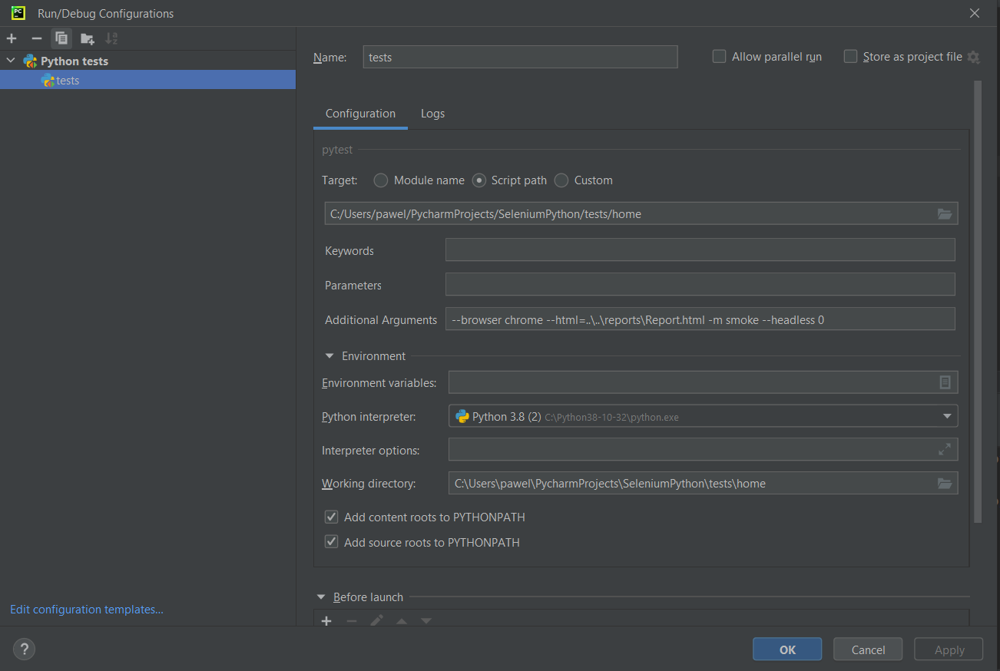

SeleniumWithPython:

1. clone repository
2. install requirements: pip install -r requirements.txt
3. download the correct version of drivers 

4. open in terminal the folder containing the test files
5. run:
info:  
 --browser [chrome, firefox, ie] --html=..\..\reports\Report.html -m mark_name

run:  
 --browser chrome --html=..\..\reports\Report.html -m smoke
 
headless:  
--browser chrome --html=..\..\reports\Report.html -m smoke --headless 1

6. or add to run configuration:

type: Python tests > pytest  
example:
